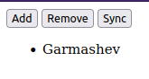
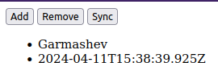
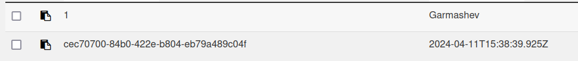
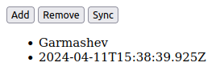
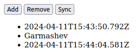
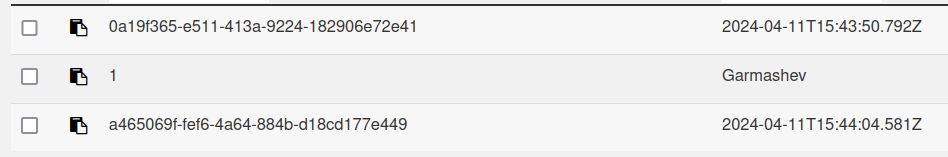

## CouchDB

1. Установить CouchDB 
2. Скачать файл ДЗ3.html 
3. Создать БД в CouchDB
4. Добавить в БД один документ в котором должно быть поле «name», в него запишите свою фамилию.
5. Прописать в ДЗ3.html путь к вашей инсталляции CouchDB.
6. Запустить ДЗ3.html и нажать кнопку «sync». Убедиться, что ваша фамилия появилась на экране.  
  
Добавил запись.  
  
Она появилась в базе данных.  
  

7. Остановить CouchDB/Couchbase сервер  
  

8. Обновить ДЗ_2.html, нажать sync, убедиться, что в нём по-прежнему фигурирует Ваша фамилия  
  
Добавил еще запись  
  
Включил couchdb, добавленная запись там появилась  
  
Все работает

9. Выключил CouchDB и сохранил результат (уже с прочитанной фамилией) в [PouchDB.html](./PouchDB.html)  
