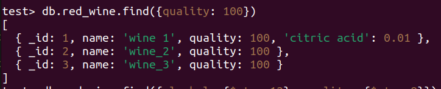
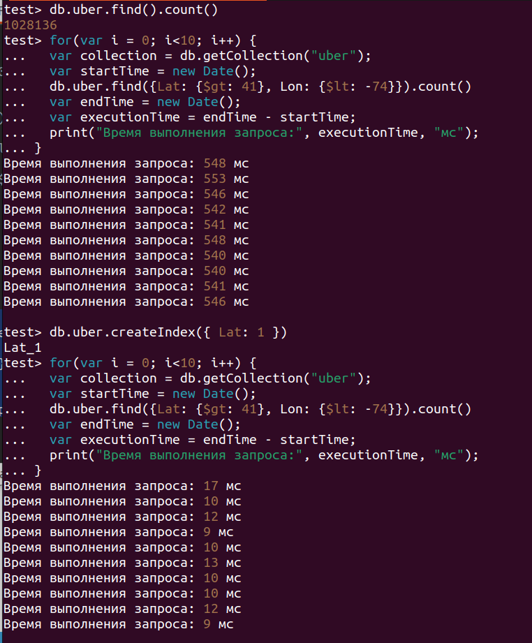

# ДЗ mongodb

## 1. Установить MongoDB одним из способов  

Я установил через docker.

Подключился к mongo shell.  

## 2. Создать базу данных и заполнить её данными из предложенных датасетов  

Я взял датасет вина.  

  

## 3. Написать несколько запросов на выборку, обновление и удаление данных (все CRUD операции);

### Create  

### Read  

  

  

  

### Update  

  

  

### Delete

  

## 4. Создать индекс и сравнить производительность запросов выборки.

Возьмем датасет на 1000000 записей.  

  
Получилось ускорение в 50 раз.  

