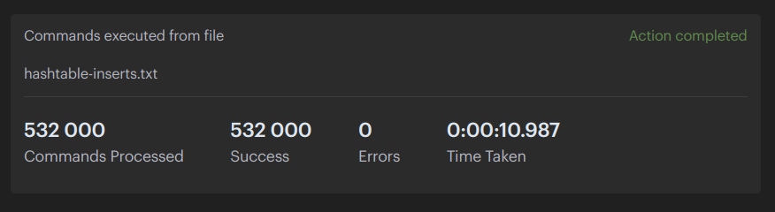

# Redis  

### Сохранить большой JSON (~20МБ) в виде разных структур - строка, hset, zset, list;  
Я взял 19МБ json с 28000 записями такого вида:

``` json
{
    "_id": "6605f7d7e994b0c3d5fd9848",
    "index": 0,
    "guid": "c31be1e4-2aec-44de-9072-68e72f5b6f4f",
    "isActive": true,
    "balance": "$2,525.62",
    "picture": "http://placehold.it/32x32",
    "age": 40,
    "eyeColor": "blue",
    "name": "Hester Suarez",
    "gender": "male",
    "company": "XYMONK",
    "email": "hestersuarez@xymonk.com",
    "phone": "+1 (961) 542-3044",
    "address": "661 Cortelyou Road, Epworth Illinois, 7233",
    "registered": "2018-06-13T03:50:57 -03:00",
    "latitude": -43.404955,
    "longitude": 25.476313,
    "greeting": "Hello, Hester Suarez! You have 5 unread messages.",
    "favoriteFruit": "strawberry"
}
```  
Сделал 4 файла с командами для сохранения.  

[string-inserts.txt](./string-inserts.txt)  
[hashtable-inserts.txt](./hashtable-inserts.txt)  
[list-inserts.txt](./list-inserts.txt)  
[zset-inserts.txt](./zset-inserts.txt)  

После сохранения получилось так:  


  
  
  


### Протестировать скорость сохранения и чтения  

#### Скорость сохранения

  
  
  
  
Скорость сохранения примерно одинаковая.  

#### Скорость операций    
  

  

  

  

Получилось, что все операции занимают примерно одинаковое время.  


### Настроить редис кластер на 3х нодах с отказоустойчивостью, затюнить таймауты.  

Я поднял 6 контейнеров для 3 мастеров и 3 слейвов.  
Таймаут сделал 10 секунд.  
  

Кластер успешно запустился.  
  
  


Попробуем написать несколько запросов.  
  
Шардирование работает, данные хранятся на разных узлах.  


Теперь протестируем отказоустойчивость.  
Для этого остановим один из контейнеров мастеров.  
  

После этого посмотрим на логи слейва.  
  
  
После отказа мастера, его роль занял другой узел.  

Попробуем обратиться к данным, которые лежали на мастере.  
  
Доступ к данным есть, кластер продолжает работать.  
Отказоустойчивость работает.  
