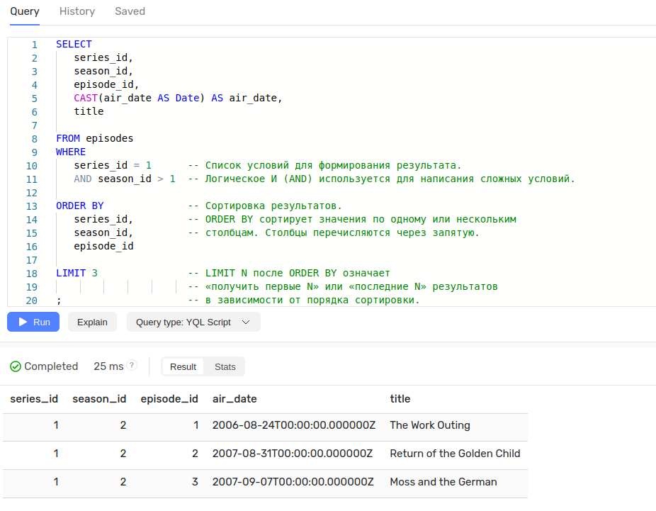

# YDB  
### История развития СУБД

В конце 2000-х набирают популярность NoSQL-решения. Во главе угла становятся проблемы масштабируемости и отказоустойчивовости, в жертву приносится диалект SQL и функциональность join. Приемлемой считается eventual consistency, то есть консистентность в конечном итоге: рано или поздно все реплики во всех зонах доступности или регионах получат консистентный набор данных. Растёт популярность key-value-хранилищ.
В 2008 Яндекс начал разарабатывать собственную NoSQL базу данных.  

В начале 2010-х появляется новый термин — NewSQL.
NewSQL-базы должны обладать масштабируемостью и отказоустойчивовостью, свойственной NoSQL-системам, но при этом предоставлять ACID-гарантии транзакций и SQL-диалект. Чуть позже термин NewSQL трансформировался — масштабируемые, отказоустойчивые БД с поддержкой SQL и строгой консистентностью стали называть Distributed SQL Databases. Вдохновившись идеей NewSQL, в 2012 году Яндекс начал разрабатывать YDB.  

В 2016 году СУБД стала использоваться в сервисах Яндекса.

В 2018 году состоялся запуск облачной платформы Yandex Cloud, хранение данных в которой было основано на YDB.  
В апреле 2022 года СУБД YDB была опубликована на GitHub как свободное программное обеспечение под лицензией Apache 2.0.  
### Инструменты для взаимодействия с СУБД  
Взаимодействовать с бд можно через интерфейс командной строки YDB CLI, также есть графический интерфейс.  

  

  

Для работы с YDB доступны OpenSource SDK для следующих языков программирования:  

    C++
    С# (.NET) 
    Go 
    Java 
    Node.js 
    PHP 
    Python 
    Rust 

### Какой database engine используется в вашей СУБД?  
Используется собственный движок, написанный на C++.  

### Как устроен язык запросов в вашей СУБД? Разверните БД с данными и выполните ряд запросов.  
YQL (YDB Query Language) — универсальный декларативный язык запросов к YDB, диалект SQL. YQL создавался для работы с большими распределенными базами данных, и поэтому обладает рядом отличий от стандарта SQL.  

Отличий от SQL не очень много.  

Изучить основной синтаксис YDB можно с помощью [туториала](https://ydb.tech/docs/ru/dev/yql-tutorial/).  

YQL имеет расширенную систему типов:  

```sql
CREATE TABLE series
(                           
    series_id Uint64,
    title Utf8,
    series_info Utf8,
    release_date Uint64,
    PRIMARY KEY (series_id) 
);
```
Для вставки в YDB помимо `INSERT` есть операторы `REPLACE INTO` и `UPSERT INTO`:

```sql
REPLACE INTO series (series_id, title, release_date, series_info)

VALUES

    -- По умолчанию числовые литералы имеют тип Int32, 
    -- если значение соответствует диапазону.
    -- Иначе тип преобразуется в Int64.
    (
        1,
        "IT Crowd",
        CAST(Date("2006-02-03") AS Uint64),   -- CAST преобразует один тип данных в другой.
                                              -- Существует возможность преобразования строкового
                                              -- литерала в литерал простого типа.
                                              -- Функция Date() преобразует строковый
                                              -- литерал в формате ISO 8601 в дату.

        "The IT Crowd is a British sitcom produced by Channel 4, written by Graham Linehan, produced by Ash Atalla and starring Chris O'Dowd, Richard Ayoade, Katherine Parkinson, and Matt Berry."),
    (
        2,
        "Silicon Valley",
        CAST(Date("2014-04-06") AS Uint64),
        "Silicon Valley is an American comedy television series created by Mike Judge, John Altschuler and Dave Krinsky. The series focuses on five young men who founded a startup company in Silicon Valley."
    )
    ;
```  
SELECT запросы выполняются так же, как в стандартном SQL.  

  

  

### Распределение файлов БД по разным носителям?
YDB — это распределенная отказоустойчивая СУБД. Она поддерживает работу кластера с возможностью создания реплик. Разделение данных по узлам проиходит автоматически по первичному ключу. Данные могут разбиваться на большее количество шардов или перемещаться между серверами в автоматическом режиме в зависимости от нагрузки. Можно настроить ключи для партиций и их количество для каждой таблицы.  

### На каком языке/ах программирования написана СУБД?  
C++  

### Какие типы индексов поддерживаются в БД? Приведите пример создания индексов.  
По умолчанию все таблицы проиндексированы по первичному ключу. Можно создать вторичный индекс для любых столбцов.  
Существует синхронный индекс и асинхронный индекс.

Синхронный индекс обновляется одновременно с таблицей, которую он индексирует. Такой индекс обеспечивает строгую согласованность данных.  

Асинхронный индекс в фоне получает изменения из индексируемой таблицы. Асинхронный индекс обеспечивает согласованность данных в конечном счете, но не строгую согласованность.  

Создадим и протестируем индекс.  
```sql
CREATE TABLE example
(
    key UInt64,
    value String,
    PRIMARY KEY (key)
);

$subquery = SELECT ListFromRange(1000, 100000) AS keys;

UPSERT INTO example
SELECT
    key,
    CAST(RandomUuid(key) AS String) AS value
FROM $subquery
FLATTEN LIST BY keys AS key
```

```sql
ALTER TABLE example ADD INDEX `index` GLOBAL ON (`value`);
```

Для использования индекса нужно указать это в запросе.  
  
  
Индекс ускорил запрос с 45 до 22 мс.  

### Как строится процесс выполнения запросов в вашей СУБД?  Есть ли для вашей СУБД понятие «план запросов»? Если да, объясните, как работает данный этап.  
YDB поддерживает просмотр плана запросов. Структура плана запроса в YDB представляет собой граф, где каждый узел содержит информацию об операциях и таблицах.  
Типы узлов:
1. Stage - cтадия выполнения запроса, например Join, Filter, Aggregate, TableFullScan ...
2. Connection - зависимость по данным между стадиями. Каждая стадия исполняется в виде некоторого количества тасков. Например, читающая таблицу стадия может исполняться в N тасков, где N - это количество шардов таблицы. От того, какой connection используется, зависит как именно данные будут передаваться между стадиями.
3. ResultSet - результат выполнения запроса, возвращаемый клиенту.  
4. Precompute - материализованный в памяти промежуточный результат.  

Подробнее можно почитать [тут](https://ydb.tech/docs/ru/yql/query_plans).  

Пример плана запроса:  
```sql
SELECT
    sa.title AS season_title,
    sr.title AS series_title,
    sr.series_id,
    sa.season_id
FROM
    seasons AS sa
INNER JOIN
    series AS sr
ON sa.series_id = sr.series_id
WHERE sa.series_id = 1
ORDER BY                         
    sr.series_id,
    sa.season_id;       
```


### Поддерживаются ли транзакции в вашей СУБД? Если да, то расскажите о нем. Если нет, то существует ли альтернатива?  
Транзакции поддерживаются.  
Есть 4 вида транзакций.  

По умолчанию транзакции в YDB выполняются в режиме **Serializable**, который предоставляет самый строгий уровень изоляции для пользовательских транзакций. В этом режиме гарантируется, что результат успешно выполненных параллельных транзакций эквивалентен определенному последовательному порядку их выполнения, при этом для успешных транзакций отсутствуют аномалии чтений.  

**Online Read-Only** — каждое из чтений в транзакции читает последние на момент своего выполнения данные. Консистентность полученных данных определяется настройкой allow_inconsistent_reads:

    false (consistent reads) — каждое из чтений по отдельности возвращает консистентные данные, но консистентность данных между разными чтениями не гарантируется. Дважды выполненное чтение одного и того же диапазона таблицы может вернуть разные результаты.  

    true (inconsistent reads) — данные даже для отдельно взятого чтения могут содержать неконсистентные результаты.

**Stale Read-Only** — чтения данных в транзакции возвращают результаты с возможным отставанием от актуальных (доли секунды). Данные в каждом отдельно взятом чтении консистентны, между разными чтениями консистентность данных не гарантируется.  

**Snapshot Read-Only** — все чтения транзакции производятся из снапшота базы данных, при этом все чтения данных консистентны. Взятие снапшота происходит в момент старта транзакции, т.е. транзакция видит все изменения, закоммиченные до момента своего начала.

Подробнее [тут](https://ydb.tech/docs/ru/concepts/transactions).


### Какие методы восстановления поддерживаются в вашей СУБД. Расскажите о них.  
YDB использует репликацию данных для обеспечения отказоустойчивости и высокой доступности. Данные автоматически реплицируются на несколько узлов кластера, что позволяет быстро восстановить работоспособность в случае отказа одного или нескольких узлов.  

Ещё YDB поддерживает создание резервных копий: 
- Резервное копирование в файлы и восстановление с помощью YDB CLI
- Резервное копирование в S3-совместимое хранилище и восстановление с помощью YDB CLI.


### Расскажите про шардинг в вашей конкретной СУБД. Какие типы используются? Принцип работы.  
В YDB шардирование происходит автоматически по умолчанию по первичному ключу. Можно настроить шардирование равномерно, по диапазону значений и по нагрузке.  

Data shard автоматически разделяются на большее количество при увеличении нагрузки. Они автоматически объединяются в нужное количество, когда пиковая нагрузка уходит.
  


Data shard также автоматически разделяются при увеличении размера данных. Они автоматически сливаются обратно, если достаточное количество данных будет удалено.
.png)  

YDB равномерно распределяет таблетки среди доступных узлов. Она перемещает тяжело загруженные таблетки с перегруженных узлов. Метрики CPU, памяти и сети отслеживаются для облегчения этого процесса.
  


### Возможно ли применить термины Data Mining, Data Warehousing и OLAP в вашей СУБД?  
Да, в YDB есть колоночные таблицы, есть поддержка JSON и функции для работы с ним, есть возможность подключения и выполнения SELECT запросов к базе данных ClickHouse.

### Какие методы защиты поддерживаются вашей СУБД? Шифрование трафика, модели авторизации и т.п.  
К YDB можно подключиться по gRPCs - протокол обмена данными с шифрованием.  

Поддерживаются следующие режимы аутентификации: 

- Аутентификация с использованием стороннего IAM-провайдера.
- Аутентификация по логину и паролю.
- Аутентификация с использованием LDAP каталога.

Можно выдавать пользователям различные права доступа.


### Какие сообщества развивают данную СУБД? Кто в проекте имеет права на коммит и создание дистрибутива версий? Расскажите об этих людей и/или компаниях.  
YDB разрабатывается командой Яндекса. Проект находится в открытом доступе на github, каждый может внести свой вклад в развитие БД.

### Создайте свои собственные данные для демонстрации работы СУБД. Как продолжить самостоятельное изучение языка запросов с помощью демобазы. Если демобазы нет, то создайте ее.  
Демобазу можно взять с сайта YDB(Создание таблицы, Добавление данных в таблицу). [ссылка](https://ydb.tech/docs/ru/dev/yql-tutorial/)
### Где найти документацию и пройти обучение  
Подробная документация с примерами есть [здесь](https://ydb.tech/docs/ru/).  
Бесплатный видеокурс по YDB [здесь](https://stepik.org/course/186264/info).  
### Как быть в курсе происходящего

cайт: https://ydb.tech/ru  
github: https://github.com/ydb-platform/ydb  
habr: https://habr.com/ru/companies/ydb/articles/  
youtube: https://www.youtube.com/c/YDBPlatform  
telegram: https://t.me/ydb_ru  